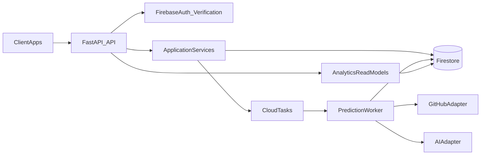

# Scalable MVP Architecture Plan

## Objectives
- Replace fragile in-process runtime state with durable, horizontally scalable persistence and async execution.
- Keep current API behavior working while introducing a production-ready architecture.
- Build advanced backend capabilities in phased increments (jobs platform, analytics, governance-ready APIs).

## Current Architecture Survey (What Exists)
- Entry and wiring are centered in [backend/app/main.py](backend/app/main.py) with routers in [backend/app/routers](backend/app/routers).
- Domain logic is concentrated in [backend/app/domain/prediction.py](backend/app/domain/prediction.py), but currently mixed with API-shaped responses.
- Persistence is split between in-memory globals in [backend/app/core/state.py](backend/app/core/state.py) and local SQLite in [backend/services/job_store.py](backend/services/job_store.py).
- Async jobs are created inside API process in [backend/app/core/jobs.py](backend/app/core/jobs.py), which does not scale reliably across multiple instances.
- API models are centralized in [backend/services/api_models.py](backend/services/api_models.py), which is a good base for controlled contract evolution.

## Target Architecture (Firebase-First)

### Core Design Decisions
- Firestore is the system-of-record for app entities (`users`, `profiles`, `predictions`, `jobs`, `job_events`, usage aggregates).
- Cloud Tasks-backed worker handles expensive prediction execution out-of-band.
- API process becomes orchestration layer only (validate, enqueue, read state), not long-running compute host.
- Existing `/api/v1/predict*` and `/api/v1/predict/jobs*` contracts stay stable initially; internals are swapped safely.

## Data Model and Persistence Plan
- Add repository layer under `backend/app/repositories/` with Firestore-backed implementations.
- Introduce explicit app services under `backend/app/services/` (application layer) to decouple routers from domain/infrastructure.
- Create Firestore model contracts and mapping functions for:
  - `jobs`: status lifecycle, timestamps, ownership, retry metadata, ttl.
  - `predictions`: request context, computed result summary, model metadata.
  - `profiles`: normalized GitHub snapshot and refresh metadata.
  - `usage_daily`: per-user request/compute counters for quotas/analytics.
- Add index and query design artifact (`firestore.indexes.json`) for production query patterns.

## API Evolution Plan
- Keep existing endpoint surface operational while introducing improved internals.
- Add production MVP endpoints in new router modules:
  - `GET /api/v1/predict/jobs` (list/filter/paginate)
  - `POST /api/v1/predict/jobs/{job_id}/retry`
  - `GET /api/v1/analytics/usage`
  - `GET /api/v1/analytics/latency`
  - `GET /api/v1/ready` and `GET /api/v1/live`
- Standardize response/error envelopes and request-id propagation across all API groups.

## Phased Implementation

### Phase 1: Foundation Refactor (No Feature Breakage)
- Create architecture folders and interfaces (repositories, app services, workers contract).
- Add Firebase config and dependency wiring in [backend/app/core/config.py](backend/app/core/config.py) and [backend/app/main.py](backend/app/main.py).
- Build Firestore-backed job repository parallel to existing SQLite repository.
- Introduce feature toggle to switch persistence backend safely (`sqlite` -> `firestore`).

### Phase 2: Async Job Platform Migration
- Replace in-process `asyncio.create_task` flow in [backend/app/core/jobs.py](backend/app/core/jobs.py) with queue enqueue + worker consumption.
- Keep current job status/poll/SSE routes compatible while reading Firestore-backed status.
- Add retry semantics and idempotency keys for job creation.

### Phase 3: Advanced MVP Modules (Backend Wow Factor)
- Add analytics read models and usage endpoints.
- Add profile/prediction history endpoints with pagination and filtering.
- Add extensible provider abstraction for AI engines and scoring pipelines.
- Add lightweight event/audit stream (`job_events`) for observability and later governance.

### Phase 4: Scalability and Operations Hardening
- Add readiness/liveness endpoints and startup dependency checks.
- Add migration scripts/seeding utilities and data retention policies.
- Add contract and integration tests for API + repository + worker flows.

## Initial Files To Create/Modify First
- Update: [backend/app/core/config.py](backend/app/core/config.py)
- Update: [backend/app/main.py](backend/app/main.py)
- Update: [backend/app/core/state.py](backend/app/core/state.py)
- Update: [backend/app/core/jobs.py](backend/app/core/jobs.py)
- Add: `backend/app/repositories/firestore_job_repository.py`
- Add: `backend/app/repositories/firestore_prediction_repository.py`
- Add: `backend/app/services/job_application_service.py`
- Add: `backend/app/routers/analytics.py`
- Add: `backend/app/routers/ops.py`
- Add: `backend/firestore.indexes.json`
- Update docs: [backend/README.md](backend/README.md), [backend/ARCHITECTURE.md](backend/ARCHITECTURE.md)

## Delivery Strategy
- Build incrementally with compatibility guards so the app remains runnable after each phase.
- Add tests alongside each phase to prevent regressions and lock contracts before advanced expansion.