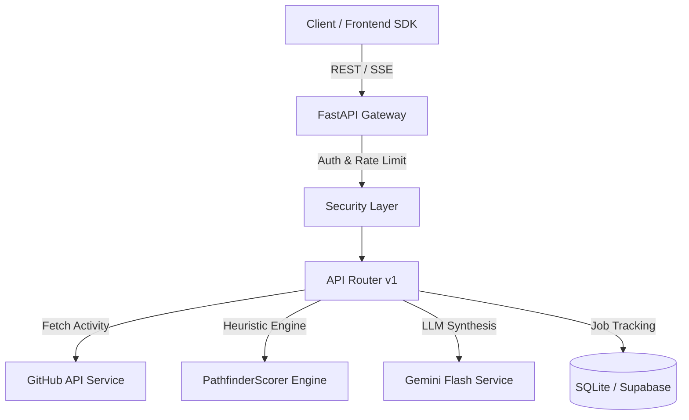

# 🚀 Pathfinder AI: Career Intelligence Engine

[](https://github.com/)
[](https://fastapi.tiangolo.com)
[](https://www.python.org/)
[](https://docs.pydantic.dev/)
[](https://ai.google.dev/)

> A career intelligence engine combining LLM-driven qualitative analysis with a quantitative heuristic engine (`PathfinderScorer`) to transform raw developer data into predictive career trajectories and Innovation Quotient (IQ) scores.

---

## 🌟 Key Highlights

- **🧠 Dual Intelligence Core**: Combines qualitative AI analysis (Google Gemini Flash) with quantitative heuristics (language rarity, commit density, project complexity).
- **⚡ Async & Non-Blocking**: Built from the ground up with FastAPI and `httpx.AsyncClient` for high throughput and resilient concurrency.
- **🛡️ Enterprise-Grade Security & Validation**: Pydantic v2 schemas, strict API key/JWT hybrid authentication, security headers, CORS policies, and rate-limiting.
- **🔄 Async Jobs & Real-Time SSE**: Background queue processing with real-time Server-Sent Events (SSE) for live status streaming.
- **🗄️ Pluggable Storage**: SQLite for quick local development and Supabase / PostgreSQL for production scaling.
- **📊 Observability & Metrics**: Dynamic form schemas, latency tracking, runtime metrics, and standard error shapes with unique `X-Request-ID`.

---

## 🏛️ Architecture Overview



---

## 📁 Repository Structure

```
├── backend/
│   ├── app/                 # FastAPI application core, config, and main entrypoint
│   ├── services/            # GitHub client, AI analysis, scoring engine, job manager
│   ├── frontend-sdk/        # Typed API client and generated OpenAPI schemas
│   ├── scripts/             # Database migration and utility scripts
│   ├── tests/               # Pytest test suite
│   ├── templates/ & static/ # Admin UI and sample views
│   ├── requirements.txt     # Locked production dependencies
│   └── README.md            # In-depth backend documentation
├── .github/workflows/       # GitHub Actions CI workflow
├── PROJECT_DNA.md           # Core philosophy & algorithm specifications
└── FRONTEND_ROADMAP.md      # UI & Frontend integration plan
```

---

## 🚀 Quick Start Guide

### 1. Prerequisites
- Python 3.11+
- Git

### 2. Setup Environment

```bash
# Clone repository
git clone <YOUR_REPO_URL>
cd "part-2 of pathfinder"

# Navigate to backend
cd backend

# Create virtual environment
python -m venv venv

# Activate virtual environment
# Windows:
.\venv\Scripts\Activate.ps1
# macOS/Linux:
source venv/bin/activate

# Install dependencies
pip install -r requirements.txt
```

### 3. Configure Secrets

Copy the example environment file:
```bash
cp .env.example .env
```

Edit `.env` with your API keys:
- `GITHUB_TOKEN`: Your GitHub personal access token
- `GEMINI_API_KEY`: Google AI Gemini API key
- `API_AUTH_KEY`: Secret key for API authentication (min 16 chars)

### 4. Run Backend Server

```bash
uvicorn app.main:app --reload --port 8000
```

- API Docs (Swagger): `http://localhost:8000/docs`
- Health Check: `http://localhost:8000/api/v1/health`

---

## 🧪 Testing

Run the test suite with `pytest`:
```bash
cd backend
pytest tests/ -v
```

---

## 📄 License & Attribution

Developed by **Tejas Gaur** (`tejasgaur94@gmail.com`).  
Licensed under the [MIT License](LICENSE).
