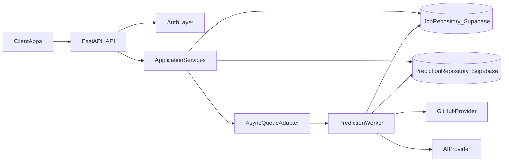

# Pathfinder Backend Architecture

## Current System Survey

### Layered file structure
- `app/main.py`: FastAPI entrypoint, middleware wiring, router mounting.
- `app/core/*`: runtime config, security, middleware, shared state, job orchestration helpers.
- `app/routers/*`: HTTP transport endpoints (`web`, `meta`, `prediction`).
- `app/domain/prediction.py`: prediction orchestration and profile metrics logic.
- `services/*`: provider integrations (`github_service`, `ai_service`) and API contracts (`api_models`).
- `templates/*`, `static/*`: server-rendered frontend.
- `tests/*`: API and service behavior tests.

### Current API surface
- `GET /`, `GET /result`
- `GET /api/v1/health`, `GET /api/v1/metrics`
- `GET /api/v1/options`, `GET /api/v1/schema/form`, `GET /api/v1/examples`
- `GET /api/v1/profile/{username}`
- `GET /api/v1/predict/{username}`, `POST /api/v1/predict`
- `POST /api/v1/predict/jobs`, `GET /api/v1/predict/jobs/{job_id}`, `DELETE /api/v1/predict/jobs/{job_id}`
- `GET /api/v1/predict/jobs/{job_id}/events`

### Persistence baseline
- In-memory process state:
  - active jobs map,
  - runtime metrics,
  - memory rate-limit state (when configured).
- Durable local persistence:
  - SQLite-backed `JobStore` for job snapshots.
- Optional distributed dependency:
  - Redis only for rate limiting.

### Gaps impacting scale
- Async jobs run in API process (`asyncio.create_task`) and are not resilient across restarts.
- Job truth is split across in-memory dict and SQLite.
- Domain layer still returns transport-shaped response objects in parts of flow.
- No first-class list/retry job operations or analytics read APIs.
- No production-ready persistent usage aggregation model.

## Target MVP Architecture (Scalable)

## Design Principles

1. **Durable-by-default workflows**
   - Jobs and prediction outputs are persisted through repositories first.
   - API responses are projections over repository data, not in-memory task handles.

2. **Pluggable infrastructure**
   - Repository and queue interfaces permit local development adapters and cloud adapters.
   - Supabase (Postgres + REST) is the preferred production data path, with SQLite fallback for local mode.

3. **Transport/application/domain separation**
   - Routers validate/authenticate and delegate to app services.
   - App services orchestrate repository + providers + queue behavior.
   - Domain logic remains reusable and testable.

4. **Compatibility-first migration**
   - Existing prediction/job endpoints remain available while internals migrate.
   - New endpoints are additive for operations and analytics.

5. **Scalability guardrails**
   - Worker execution path removes expensive compute from request path where possible.
   - Read APIs support pagination and filtered retrieval.

## Data Model Direction

- `jobs`: lifecycle state, timestamps, request payload, result ref/data, error envelope, retry metadata.
- `predictions`: request context, profile metrics summary, model metadata, result payload.
- `profiles`: normalized GitHub snapshot and refresh timestamp.
- `usage_daily`: request and compute counters by date for analytics/quota.

## Execution Roadmap Summary

- Phase 1: repository and app-service foundations, environment wiring.
- Phase 2: queue-based job execution migration with compatibility routes intact.
- Phase 3: analytics/history endpoints and provider abstraction.
- Phase 4: operations readiness, index artifacts, and integration tests.
